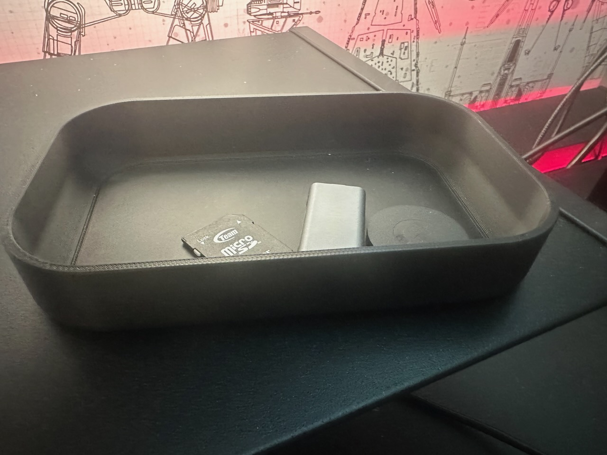
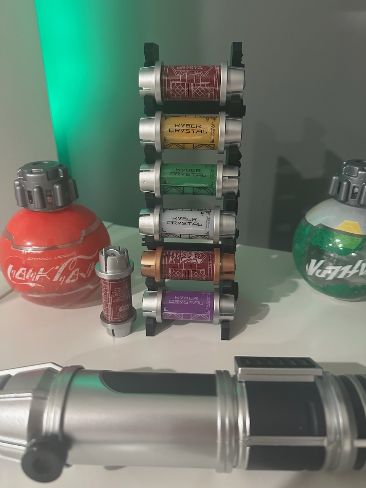
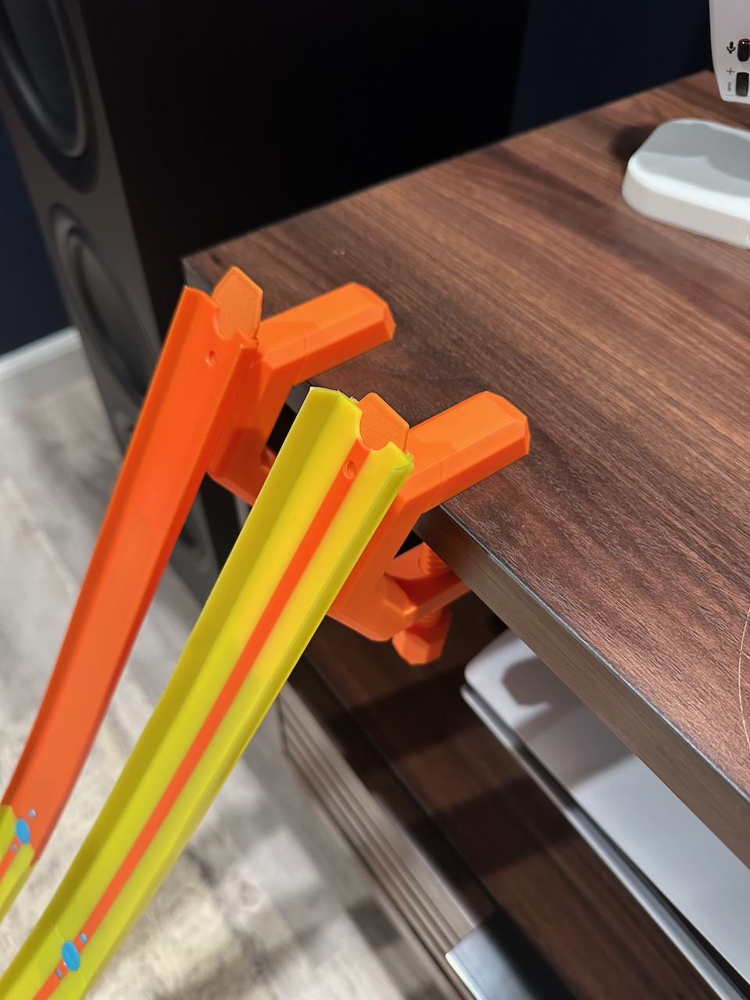
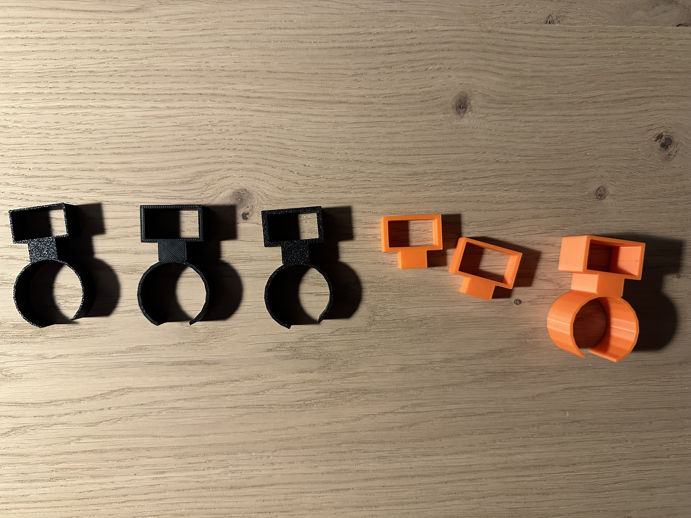
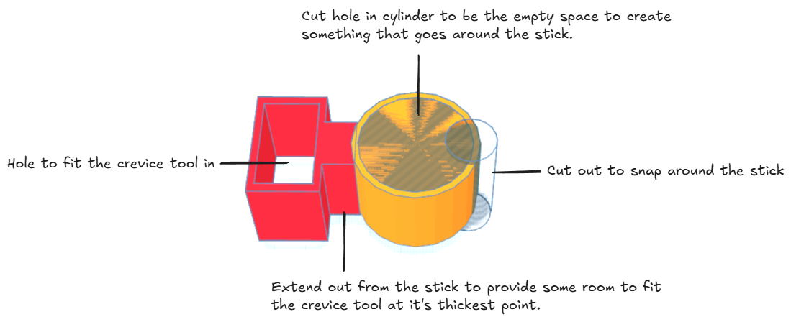

Over the years 3D printing has become more and more common. I've casually followed along thinking it was something that seemed fairly interesting but something out of my reach whether it be due to pricing or lack of ability to have anything useful to print. However recently for my 39th birthday I received a Bambu Labs P1S with the AMS and I can't believe what I've been missing out on for the last few years. Here's what I've learned.

In this post, I'll share my beginner's journey into the world of 3D printing, including:

- How to tap into the vast ecosystem of open-source 3D designs
- Real examples of practical home organization projects I've completed
- My step-by-step process for designing my first custom print (a solution for my Wyze vacuum)
- Tips for iterating designs through rapid prototyping
- Recommended software tools and resources for getting started
- What to expect in terms of learning curve, filament usage, and time investment

Whether you're considering purchasing your first 3D printer or looking to make better use of one gathering dust in your home office, I hope my experiences will help demystify the process and inspire your own creative projects. In just a few weeks, I've transformed drawers, desks, and everyday items around my home with custom-designed organizational tools - and the satisfaction of creating physical solutions to everyday problems has been incredibly rewarding.

## Lots of designs are available
It turns out that like software, there is a large open source community around 3D printing. Thousands of designs are available to everyone to print on their own devices. The community is very active and prolific in sharing their creations. Most of these are distributed for personal use only, meaning you can't go trying to sell their creations on your own. However many ALSO provide an option to purchase a license for commercial use. These come in either single purchases for a specific pattern or as subscriptions to a user's content which gives you the ability to print and sell any of their patterns while you have an active subscription with them. One of my favorite places to find designs is Bambu Labs' own [makerworld.com](https://www.makerworld.com).

## What have I printed?
A lot of my time has been spent on printing things that are useful around the house. One of the popular open source projects is called [Gridfinity](https://gridfinity.xyz/) which was created and open sourced by [Zack Friedman](https://www.youtube.com/c/ZackFreedman). As someone who loves organization this has been a dream come true. So far I've used Gridfinity to organize our buffet's drawer, my Ikea Alex Drawer and soon my tool chest to name a few. Gridfinity works off a 42x42x7xmm grid. You can lay out this grid in the item you're looking to organize and then print out bins or trays to go into the grid specifically tailored to the things you are trying to store. There are tons of Youtube videos on the topic, so if you're interested in learning more check there, though one of my favorites is [Gridfinity for Dummies by Uncle Jessy](https://www.youtube.com/watch?v=TvIvoY013xQ&t=633s&pp=ygUKZ3JpZGZpbml0eQ%3D%3D).

Asides from a lot of Gridfinity printing I've printed other organizational things as well. Here's a quick break down.

[Modern Rectangular Key Tray](https://makerworld.com/en/models/543327-modern-rectangular-key-tray#profileId-461077) for my gaming desk

[Kyber Crystal stand](https://makerworld.com/en/models/767418-kyber-crystal-version-1-stand-6-crystals#profileId-**702783**) for the Kyber crystals I purchased at Disney last year.

[Mario Pipe](https://makerworld.com/en/models/83645-mario-pipe-no-supports#profileId-89341) to act as a toothbrush holder for my son.

[Hot Wheels track clamp](https://makerworld.com/en/models/88398-hot-wheels-track-clamp#profileId-1285344).

[Multiple Stacking Storage Baskets](https://makerworld.com/en/models/520956-eternity-labs-stacking-storage-basket-140x200mm#profileId-473125) to organize my office
A [Funko Pop Stand](https://makerworld.com/en/models/897957-funko-pop-stand#profileId-856396) for a  Rescue funko that just wouldn't stand on it's own.
As well as tools for printing itself like this [ProClip Filament Clip](https://makerworld.com/en/models/30298-proclip-filament-clip#profileId-33200) to clip filament to the spool when not in use. As you can see the possibilities are endless and I've only just touched the surface. I have a huge backlog of prints I want to get to.

## Designing your own prints
So there's a clearly and almost endless availability of designs available to print but what if you need to do something no one else has done before? From here you can dive into designing your own 3D models to print. It's not as daunting as it sounds.

Within my first week I decided it was time to  design my own print. Around December we purchased a Wyze vacuum from the TikTok shop which we love. The only thing about it I didn't love is there's no place to put the crevice tool if you're using the stick attachment instead.  I did a  search across the common places to find 3D print designs for such a thing but I couldn't find anything. This felt like my first opportunity to dive into designing my own print.

To design  your own print there are a lot o f software options available to you. I decided to ask ChatGPT for some help:

> What tools are available to design things to print on a 3d printer?

> ### **Beginner-Friendly Tools**
> 
> 1. **Tinkercad** (Free, Web-based)
>     
>     - Drag-and-drop interface
>     - Great for simple designs and educational use
>     - Exports directly to STL for printing
> 2. **3D Slash** (Free with paid features, Desktop/Web)
>     
>     - Minecraft-style block building
>     - Easy for creating basic models quickly
> 3. **SculptGL** (Free, Web-based)
>     
>     - Focuses on sculpting rather than geometric design
>     - Good for creating organic shapes like figurines
> 
> ---
> 
> ### **Intermediate Tools**
> 
> 1. **Fusion 360** (Free for hobbyists, Paid for professionals)
>     
>     - CAD tool for precise engineering and mechanical parts
>     - Parametric design features
>     - Integrated simulation and analysis tools
> 2. **FreeCAD** (Free, Open-source)
>     
>     - Parametric 3D modeler
>     - Highly customizable with Python scripting
> 3. **SketchUp** (Free with paid versions, Web/Desktop)
>     
>     - Easy to learn with intuitive interface
>     - Good for architectural and mechanical designs
> 
> ---
> 
> ### **Advanced/Professional Tools**
> 
> 1. **Blender** (Free, Open-source)
>     
>     - Advanced sculpting and modeling tools
>     - Ideal for artistic models and detailed textures
>     - Complex learning curve but very powerful
> 2. **ZBrush** (Paid)
>     
>     - Industry standard for digital sculpting
>     - Great for high-detail organic models like characters and statues
> 3. **SolidWorks** (Paid, Professional CAD)
>     
>     - Widely used in industrial design and engineering
>     - Supports parametric design and complex assemblies
> 
> ---
> 
> ### **Specialized Tools for Specific Needs**
> 
> 1. **Meshmixer** (Free, Autodesk)
>     
>     - Optimizing, repairing, and modifying STL files
>     - Great for fixing 3D scan errors and creating supports
> 2. **PrusaSlicer** / **Cura** (Free)
>     
>     - Primarily for slicing models for printing
>     - Includes basic design and customization tools for supports and modifications
> 3. **MatterControl** (Free)
>     
>     - Combines CAD design and 3D printing management
>     - Good for integrating design, slicing, and printer control in one tool
> 
> ---
> 
> ### **File Formats Commonly Used**
> 
> - **STL** – Standard format for 3D printing
> - **OBJ** – Supports color and texture information
> - **3MF** – Advanced format with better metadata handling

## Getting started with Tinkercad

I decided to go with  [Tinkercad](https://www.tinkercad.com/) as 1. it was free to use,. 2 I had seen some other videos discussing this and 3 when  I broke down what I  needed to make it could really be broken down into some simple shapes. The model could be broken down into 3 boxes and 3 cylinders. To get started I broke out a digital caliper (I purchased [this one](https://www.amazon.com/dp/B07X8JQ8L5?ref_=ppx_hzsearch_conn_dt_b_fed_asin_title_1) off Amazon) and got to measuring. First, I measured the circumference of the stick, excluding the  part that extends out of the main cylinder. Second, I measured the width and depth of the crevice tool as well as the width of the thickest part of the tool. Then  I set out into Tinkercad and began the dance of trial an error.

My first design  I went with used exact dimensions of the tool and vacuum stick. This printed in about 15 minutes so I had a pretty quick feedback loop. While this print didn't quite work it was a huge success in proving that 1. I was on the right track with my shapes and 2. I felt fairly confident I could iterate on the design and get somewhere. The design successfully snapped onto the vacuum stick which was my biggest worry. The crevice tool also fit right into the hole I had created. The biggest problems  I faced though were that the plastic and design felt very thin and thus flimsy and 2 that the hole I made for the crevice tool was a little to precise which meant while it did in fact fit, you had to push it through.

So I went on to adjust a few things. First I wanted to make the whole thing more rigid. So I increased the size of my wrapping cylinder. Next, I want to similarly make the “box” that holds the tool more rigid as well so I increased the size of the wrapping box. I went ahead and printed this and after about 15 minutes I saw improved results. The object produced was much more rigid and felt sturdy, but there was still room for improvement. I hadn’t increased the size of the hole so this still needed to be remedied. I also noticed that my cut outs weren’t aligned properly and were askew. I headed back to Tinkercad and used the align tool to fix the alignment and grew the cut out that I had made for the tool. I had to ensure that I also increased the wrapping box so that the increased size in the cut out didn’t get rid of my newly found rigidity.

I printed my 3rd version of my attachment and found reasonable results. The cut out was now aligned properly however the hole still wasn't quite big enough. It was at this point that I decided to adjust my strategy to finding the right print by removing the clamp part of the model and only printing the box part that would hold the tool. This would allow me to more quickly iterate on the design while also reducing waste of filament during my experimentation. After a couple of test prints using this method I finally achieved the right balance of tension in the hole with ease of dropping the tool in. It was time to combine my findings and print out the whole thing. Before I did so though there was one more area for improvement. So far the product was fairly small in height. While this got the job done, the finished product didn't feel that great. Due to the height of the product whenever you wanted to attach the crevice tool, you had to hold the attachment tightly to ensure that the weight of dropping it in didn't cause the whole thing to slide down the stick. In order to remedy this I decided to increase the height of the attachment so that it had a stronger connection to the stick. One final test print later and it worked!

**Final Design**

This was the final design of the attachment. I've also uploaded the attachment to MakerWorld for anyone who might find it useful in the future. You can find it here [Wyze Cordless Vacuum 5 Crevice Tool Holder](https://makerworld.com/en/models/1175132-wyze-cordless-vacuum-s-crevice-tool-holder#profileId-1184159). 
## Conclusion
I've really enjoyed diving into the world of 3D printing and wish I had done so sooner! It's quite satisfying creating things with your printer for real world use and even better designing your own creations. The process I went through designing my own 3D model for printing felt very reminiscent of a red green refactor cycle in test driven development. I also borrowed from my software background to find ways to get quicker feedback cycles and build an MVP.

Feel free to follow me on [Instagram](https://www.instagram.com/dgalarzatech/) where I've been trying to share more of my creations.
